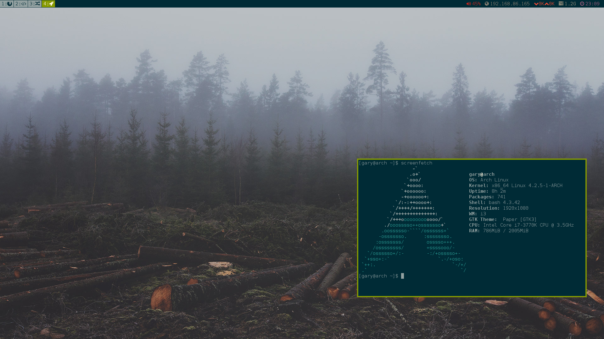

# i3-Dotfiles
Config and scripts for my i3wm install.

<b>Dependencies:</b>
  i3-Gaps,
  i3lock,
  i3lock-wrapper,
  i3bar,
  i3blocks,
  FontAwesome,
  Rofi,
  Compton,
  Termite terminal,
  Paper GTK Theme,
  
  
  Run this to install all the dependencies. These might be outdated.
  <code>yaourt -S i3-gaps-git i3lock-git i3lock-wrapper i3blocks-git ttf-font-awesome rofi-git compton-git termite-git paper-gtk-theme-git paper-icon-theme-git</code>

